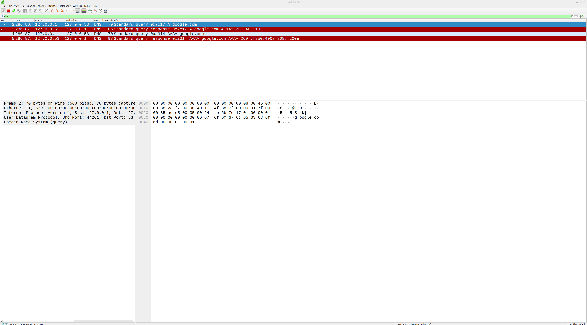
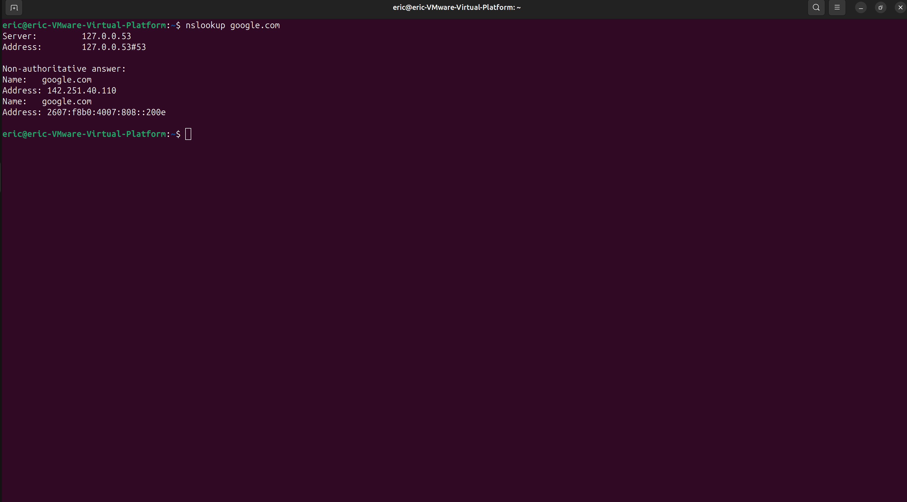
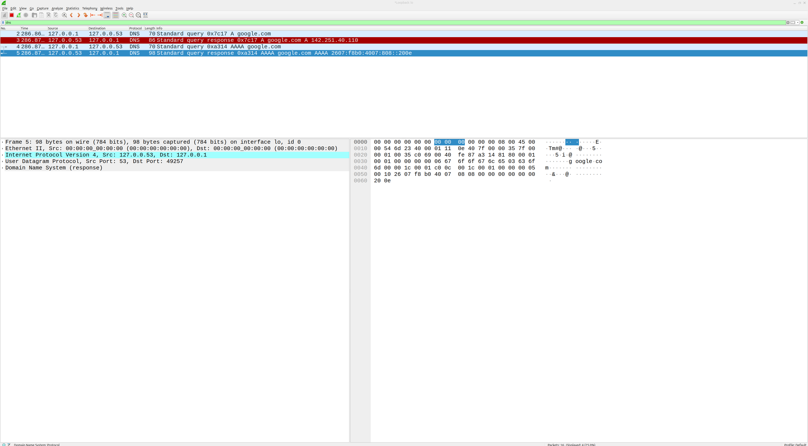

# SOC Lab 07 — Suspicious DNS Traffic Analysis

## Table of Contents
1. [Executive Summary](#executive-summary)
2. [Lab Objectives](#lab-objectives)
3. [Environment Overview](#environment-overview)
4. [Detection Workflow](#detection-workflow)
5. [Traffic Analysis](#traffic-analysis)
6. [Detection Engineering Insights](#detection-engineering-insights)
7. [Evidence](#evidence)
8. [Conclusions](#conclusions)
9. [Next Steps](#next-steps)

---

## Executive Summary

This lab focuses on capturing and analyzing DNS traffic to understand how domain name resolution appears in packet captures.

DNS is one of the most common protocols observed in enterprise environments and is frequently used by both legitimate applications and malicious activity. Security analysts must be able to identify normal DNS behavior and recognize suspicious patterns that may indicate reconnaissance, malware communication, or data exfiltration.

In this lab, DNS traffic will be generated and captured using Wireshark. The captured traffic will then be analyzed to identify DNS queries, responses, and protocol behavior relevant to SOC investigations.

This lab demonstrates how analysts inspect DNS activity and build foundational network visibility skills for threat detection.

---

## Lab Objectives

- Generate DNS traffic in a controlled environment
- Capture DNS queries and responses using Wireshark
- Identify key DNS protocol fields
- Analyze normal DNS lookup behavior
- Recognize how DNS traffic may appear during suspicious activity
- Develop packet analysis skills relevant to SOC operations

---

## Environment Overview

**Operating System:** Ubuntu Linux (Virtual Machine)

**Tools Used**

- Wireshark
- `nslookup`

**Network Setup**

- Localhost and external DNS resolution
- Single VM environment

---

## Detection Workflow

DNS traffic provides valuable visibility into both normal and potentially malicious network activity.

In this lab, standard DNS query and response behavior was observed. However, similar traffic patterns are often leveraged by attackers for command-and-control communication, domain generation algorithms (DGA), and data exfiltration.

Security teams can build detections by monitoring for:

- Unusually high volumes of DNS queries from a single host
- Requests to newly registered or low-reputation domains
- DNS queries with long or random-looking domain names
- Repeated failed DNS queries (NXDOMAIN responses)
- DNS traffic to uncommon or suspicious external servers

These behaviors can be analyzed using network monitoring tools, intrusion detection systems (IDS), and SIEM platforms.

Understanding how normal DNS traffic appears in packet captures allows analysts to more easily identify deviations that may indicate malicious activity.

### 1. Start Packet Capture in Wireshark

Wireshark was used to capture live DNS traffic for analysis. The capture was initiated on the appropriate network interface prior to generating DNS queries.

---

### 2. Generate DNS Traffic

DNS traffic was generated using the `nslookup` command to resolve a domain name.

**Command:**

```bash
nslookup google.com

## Traffic Analysis

The packet capture revealed standard DNS query and response behavior.

After applying the `dns` filter in Wireshark, DNS packets were isolated showing communication between the local system and the configured DNS server. The captured traffic included both query and response messages.

The DNS query generated by the `nslookup google.com` command can be identified by examining the request packet, which contains the queried domain name (`google.com`) and the query type.

The corresponding DNS response packet contains the resolved IP address for the domain, demonstrating successful name resolution. This exchange represents normal DNS behavior within a network.

From a SOC perspective, this type of traffic is important because DNS queries are frequently used by both legitimate applications and malicious actors. Monitoring DNS traffic can help identify unusual patterns such as high query volume, requests to suspicious domains, or communication with known malicious infrastructure.

## Detection Engineering Insights

DNS traffic provides valuable visibility into both normal and potentially malicious network activity.

In this lab, standard DNS query and response behavior was observed. However, similar traffic patterns are often leveraged by attackers for command-and-control communication, domain generation algorithms (DGA), and data exfiltration.

Security teams can build detections by monitoring for:

- Unusually high volumes of DNS queries from a single host
- Requests to newly registered or low-reputation domains
- DNS queries with long or random-looking domain names
- Repeated failed DNS queries (NXDOMAIN responses)
- DNS traffic to uncommon or suspicious external servers

These behaviors can be analyzed using network monitoring tools, intrusion detection systems (IDS), and SIEM platforms.

Understanding how normal DNS traffic appears in packet captures allows analysts to more easily identify deviations that may indicate malicious activity.

## Evidence

All screenshots are stored in the repository and demonstrate DNS query generation and packet-level analysis.







## Conclusions

This lab demonstrated how DNS traffic can be captured and analyzed using Wireshark.

By generating DNS queries with `nslookup`, we were able to observe the full query and response process at the packet level. The analysis showed how domain names are resolved into IP addresses and how this communication appears in network traffic.

Understanding DNS behavior is critical for SOC analysts, as DNS is frequently used in both legitimate operations and malicious activity. Being able to identify normal DNS patterns provides a foundation for detecting suspicious or anomalous behavior in real-world environments.

## Next Steps

To continue developing network analysis and detection skills:

- **SOC Lab 08 — HTTP Traffic Analysis**
- Capture and analyze HTTP requests and responses
- Identify key HTTP methods and status codes
- Understand how web traffic appears in packet captures

This progression builds on DNS analysis and expands into application-layer protocol visibility.
